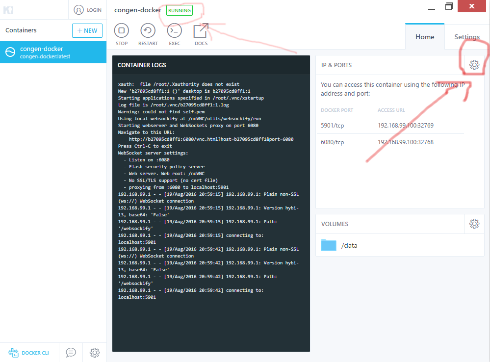
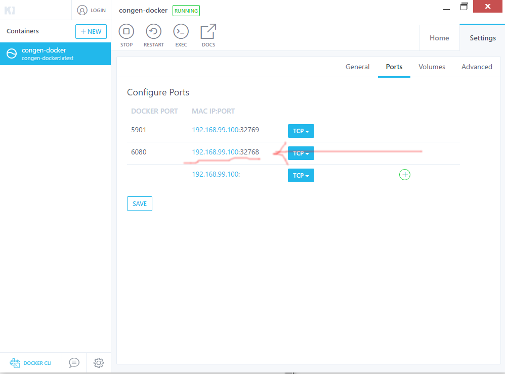

A docker machine for data analysis of genomics data
===================================================

This machine is used for a course in conservation genetics at the
University of Montana

How to run it
-------------

**Initial note (for more advanced users)**

The docker container runs a VNC and SSH server. If you have a VNC client
installed you do not need to use the browser interface as it is slower.
Just point your VNC server to port 5901.

You can also connect directly via ssh. User root, password congen16.

You will have root access and that is fine. There will be no special user.

**If you are on Windows or Mac (see below for Linux)**

- Install Kitematic_ (Docker Toolbox).

- Start it

- Pull tiagoantao/congen_docker (using the search box)

- Make the congen container is running (UI - see below)

- Go to settings (see image below)

- Click on the 6080 port (see below)

- This should start a browser

- Password is `congen16`

**What to do if your base operating system is Linux**

- Install docker

- Make sure the docker server is running

- Your user has to be on the docker group

- ``docker pull tiagoantao/congen-docker``

- ``docker run -p 6080:6080 -v /path_to_your_data:/data -t tiagoantao/congen-docker``

- Change `path_to_your_data` with the path to your data.

- Start a browser pointing to the address ``http://127.0.0.1:6080``

- Password is `congen16`

.. _Kitematic: https://kitematic.com/
